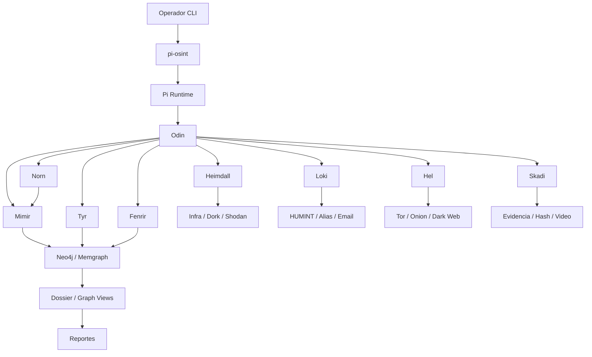

# Karasugakure — Arquitectura OSINT CLI-only

## Panteón de Agentes

| Agente | Función OSINT | Herramientas / Binarios | Rol v3.1 |
| :--- | :--- | :--- | :--- |
| Odin | Orquestador core y threat modeler. Decide qué buscar, cuándo y con qué profundidad. | langgraph, modelo de alto razonamiento | Antigravity |
| Heimdall | Recon de infraestructura y superficie. | amass, spiderfoot, shodan-cli | Minato |
| Loki | HUMINT, identidades, alias y huellas digitales. | sherlock, holehe, theHarvester | Kurama |
| Hel | Deep/Dark Web, foros y onion. | Tor, SOCKS5, scrapers onion | Tobirama |
| Mimir | Memoria histórica y archivo relacional. | Neo4j, Memgraph, Cypher | Itachi adaptado |
| Tyr | Validación de inteligencia y control de falsos positivos. | Python puro, matriz NATO | Gudodama |
| Skadi | Congelación de evidencia y firmado forense. | gowitness, sha256, ffmpeg | Mu_Kage |
| Fenrir | Correlación agresiva y enlace entre nodos. | parsers, enrichers, rules | Nuevo |
| Norn | Traducción NL↔graph y normalización semántica. | LLM, Cypher compiler | Nuevo |

## Diagrama



## Adaptaciones críticas

Karasugakure sustituye la memoria semántica general por una memoria relacional basada en grafo. Mimir mantiene nodos, aristas, evidencias y fuentes con confianza y procedencia, porque en OSINT el valor está en relaciones, no sólo en similitud textual.

Tyr reemplaza la validación de exploit por validación de inteligencia. Toda evidencia recibe una calificación de fiabilidad de fuente y credibilidad de la información, y cualquier hallazgo por debajo de C3 queda como tentative salvo orden explícita de Odin.

La OPSEC es obligatoria. Loki y Hel no deben salir por la red nativa del host; todo tráfico ruidoso pasa por Tor o proxies rotativos, con configuración separada en `~/.config/opencode/opsec/`.

## Estructura base

```text
~/.karasugakure/
├── bin/
├── core/
│   ├── runtime/
│   ├── router/
│   ├── policy/
│   └── session/
├── agents/
│   ├── odin/
│   ├── heimdall/
│   ├── loki/
│   ├── hel/
│   ├── mimir/
│   ├── tyr/
│   ├── skadi/
│   ├── fenrir/
│   └── norn/
├── adapters/
├── graph/
│   ├── ingest/
│   ├── cypher/
│   └── db/
├── opsec/
├── evidence/
└── reports/
```

## Decisión de diseño

El traductor entre lenguaje natural y grafos debe ser un agente intermedio dedicado. Norn recibe instrucciones del operador o de Odin, convierte intenciones en consultas Cypher y devuelve resultados normalizados para Mimir y Tyr; eso desacopla el razonamiento del core y reduce acoplamiento semántico.
