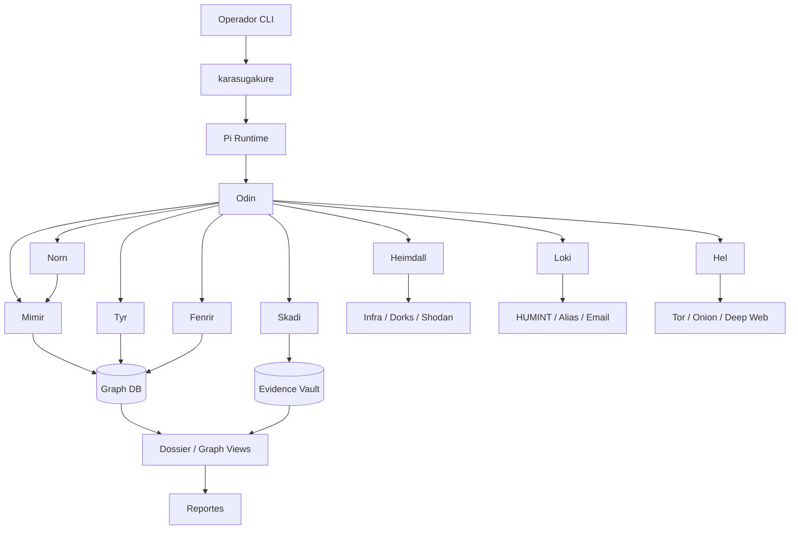

# Karasugakure — Arquitectura CLI-only OSINT

## Diagrama



## Estructura de proyecto

```text
~/.karasugakure/
├── bin/
│   └── karasu
├── core/
│   ├── runtime/
│   ├── router/
│   ├── policy/
│   ├── session/
│   └── hooks/
├── agents/
│   ├── odin/
│   ├── heimdall/
│   ├── loki/
│   ├── hel/
│   ├── mimir/
│   ├── tyr/
│   ├── skadi/
│   ├── fenrir/
│   └── norn/
├── adapters/
│   ├── web/
│   ├── social/
│   ├── darkweb/
│   ├── archive/
│   ├── evidence/
│   └── graph/
├── graph/
│   ├── db/
│   ├── cypher/
│   ├── ingest/
│   └── export/
├── opsec/
│   ├── proxychains4.conf
│   ├── torrc
│   ├── ua_rotation.json
│   └── tls_fingerprint_policy.json
├── evidence/
│   ├── screenshots/
│   ├── html/
│   ├── transcripts/
│   ├── hashes/
│   └── video/
├── reports/
└── sessions/
```

## Fase 0 — Threat model

**Dominio:** OSINT táctico CLI-only.

**Activo crítico:** identidad, relación entre identidades, infraestructura vinculada, evidencia preservable.

**Adversario primario:** objetivo que borra huellas, cambia cuentas, rota IP y mezcla identidades.

**Vectores top:**
1. alias collision entre personas homónimas;
2. enlaces débiles entre email, repo y red social;
3. registros expuestos en buscadores, archivos y archives;
4. fuga de OPSEC por requests directos sin proxy;
5. sobreconfianza en evidencia sin validación cruzada.

## Reglas de ejecución

1. Todo pasa por Odin.
2. Toda relación pasa por Norn.
3. Toda relación ingresa al grafo por Mimir.
4. Toda evidencia se firma con Skadi.
5. Toda evidencia dudosa se degrada por Tyr.
6. Todo tráfico ruidoso sale por OPSEC.
7. Ningún comando destructivo sin confirmación explícita del operador.

## Contrato funcional

- `karasu recon` → superficie e infraestructura.
- `karasu humint` → alias, emails, perfiles.
- `karasu darkweb` → onion, foros, dumps.
- `karasu archive` → wayback, caches, mirrors.
- `karasu graph ingest` → crea nodos y aristas.
- `karasu graph query` → consulta relacional.
- `karasu validate` → aplica Tyr.
- `karasu freeze` → congela evidencia.
- `karasu report` → dossier final.

## Decisión clave

Sí, crear un agente intermedio dedicado es la decisión correcta. Norn traduce intención operativa en Cypher y Cypher en salida normalizada; Odin sólo gobierna estrategia y priorización. Eso mantiene limpio el core y hace el sistema extensible.
